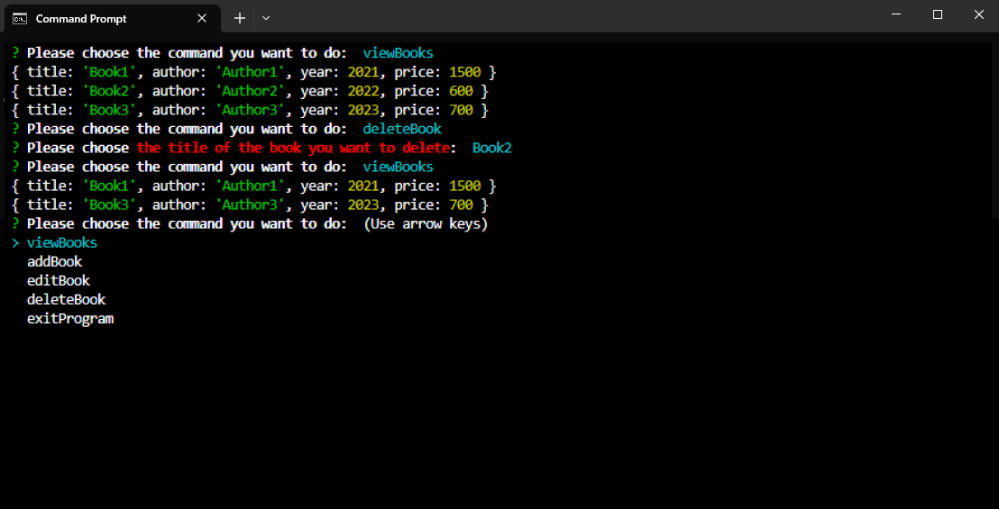

# ระบบจัดการหนังสือ (Book Management System) ด้วย JavaScript

**Task Week 1 : Back-End Dev for Dev Init**


เมื่อผู้ใช้ Log in เข้ามาในระบบจัดการหนังสือ ผู้ใช้จะเห็น Menu คำสั่งทั้งหมด 5 คำสั่งด้วยกัน คือ
- viewBooks
- addBook
- editBook
- deleteBook
- exitProgram

โดยคำสั่ง `viewBooks` จะเป็นคำสั่งสำหรับให้ผู้ใช้เรียกดูรายการหนังสือทั้งหมดที่มีอยู่ในระบบ ซึ่งจะถูกแสดงออกมาในรูปแบบ ดังนี้
```
{ title: 'Book1', author: 'Author1', year: 2021, price: 500 }
{ title: 'Book2', author: 'Author2', year: 2022, price: 600 }
```


- จากในรูปจะเห็นได้ว่าในระบบจัดการหนังสือของเรามีข้อมูลหนังสืออยู่ทั้งหมด 2 เล่ม คือ Book1 และ Book2 ซึ่งแต่ละเล่มก็จะประกอบไปด้วยข้อมูล ผู้เขียน ปีที่ตีพิมพ์ และราคา

มาต่อกันที่คำสั่ง `addBook` ซึ่งเป็นคำสั่งสำหรับให้ผู้ใช้เพิ่มข้อมูลหนังสือที่ต้องการเข้าไปในระบบ ซึ่งผู้ใช้จะต้องกรอกข้อมูล ดังต่อไปนี้
```
Please enter the title of the book you want to add:
Please enter the author of this book:
Please enter the year this book was published:
Please enter the price of this book:
```


- จากในรูปจะเห็นได้ว่าเราต้องการจะเพิ่มข้อมูลหนังสือ ชื่อ Book3 ผู้เขียน Author3 ตีพิมพ์ในปี 2023 ราคา 700 บาท เข้าไปในระบบ

คำสั่ง `editBook` เป็นคำสั่งสำหรับให้ผู้ใช้ทำการแก้ไขข้อมูลหนังสือที่มีอยู่ในระบบ โดยผู้ใช้จะต้องทำการเลือกหนังสือที่ต้องการจะแก้ไขข้อมูล จากนั้นจึงกรอกข้อมูลที่ต้องการแก้ไขลงไป ดังตัวอย่าง
```
? Please choose the title of the book you want to edit:  (Use arrow keys)
> Book1
  Book2
  Book3
Please correct this information
Please enter the title of this book [Book1] :
Please enter the author of this book [Author1] :
Please enter the year this book was published [2021] :
Please enter the price of this book [500] :
```


- จากในรูปจะเห็นได้ว่าเราต้องการจะแก้ไขข้อมูลหนังสือที่ชื่อ Book1 ในระบบ โดยแก้ไขข้อมูลราคา จากราคา 500 บาท เปลี่ยนเป็นราคา 1500 บาท

ส่วนคำสั่ง `deleteBook` ก็คือคำสั่งสำหรับให้ผู้ใช้ลบข้อมูลหนังสือที่มีอยู่ออกไปจากระบบ โดยผู้ใช้จะต้องทำการเลือกหนังสือที่ต้องการจะนำออกไปจากระบบ ดังนี้
```
? Please choose the title of the book you want to delete:  (Use arrow keys)
> Book1
  Book2
  Book3
```



- จากในรูปจะเห็นได้ว่าเราต้องการจะลบข้อมูลหนังสือที่ชื่อ Book2 ออกไปจากระบบ ซึ่งเมื่อระบบได้ทำการนำข้อมูลหนังสือที่ชื่อ Book2 ออกไปแล้ว ในระบบของเราก็จะเหลือหนังสือเพียง 2 เล่ม ก็คือ Book1 และ Book3 นั่นเอง

สุดท้ายคำสั่ง `exitProgram` เป็นคำสั่งที่ใช้สำหรับปิดระบบจัดการหนังสือนี้ โดยระบบจะมีคำถามเพื่อขอการยืนยันจากผู้ใช้อีกครั้งนึงก่อนปิดตัวลง
```
? Do you want to exit the book-management system:  (Use arrow keys)
> Yes
  No
```


- จากภาพแสดงให้เห็นว่าผู้ใช้ได้ทำการ Log out ออกจากระบบจัดการหนังสือเรียบร้อยแล้ว